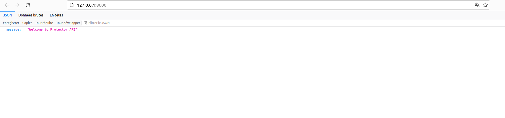
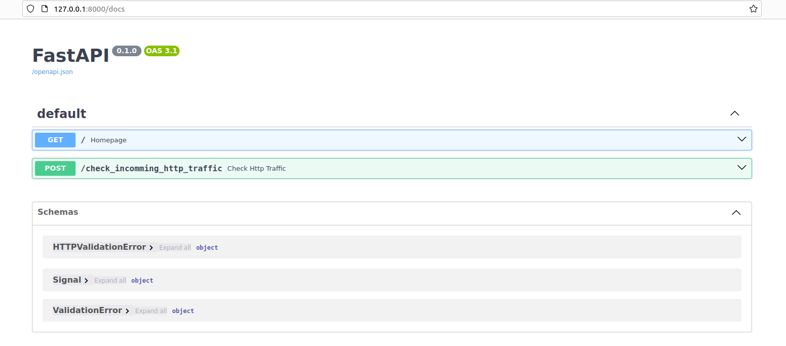
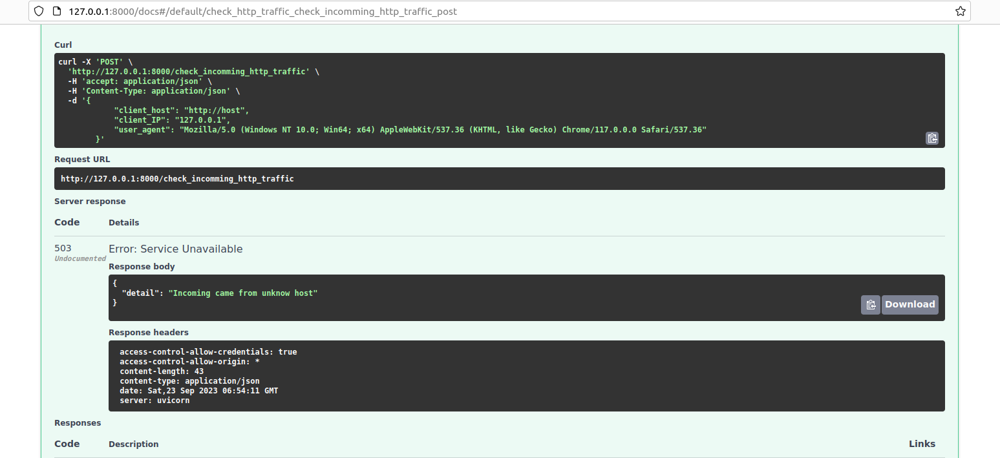

## PROTECTOR API

Webservice in charge of http traffic base of FastAPI , Poetry and Docker

### DEPENDENCIES
  
  - [Python](https://www.python.org/downloads/) 
  - [Poetry](https://python-poetry.org/) 
  - [FastAPI](https://fastapi.tiangolo.com/)
  - [Docker](https://www.docker.com/)

### GETTINGS STARTED

  1 - Clone the repository
  ` git clone `

  2 - Install dependencies using Poetry
  ` poetry install `

  3 - Start the webservice
  ` make start `

Once thoses step done, your server will run in docker container available
at  ' http://localhost:8000 '

### API DOCUMENTATIONS

Homepage

---

Endpoints availables

---
Request from unknow origin

---

